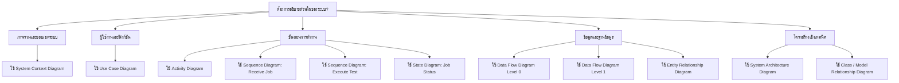

# สรุปการเลือกใช้ Diagram สำหรับ QC Lab Tracking System

เอกสารนี้สรุปว่า diagram จากไฟล์หลัก `docs/qc-diagrams.md` ตัวใดควรใช้ในเล่มหรือเอกสารนำเสนอ โดยเรียงตามความสำคัญและวัตถุประสงค์ของแต่ละภาพ

## คำแนะนำแบบสั้น

ถ้าต้องเลือกชุด diagram ที่ควรใช้จริงในเล่ม แนะนำให้ใช้ชุดหลักนี้:

1. **System Context Diagram** - ใช้เปิดภาพรวมระบบและขอบเขตงาน
2. **Use Case Diagram** - ใช้อธิบายผู้ใช้งานและความสามารถหลักของระบบ
3. **Activity Diagram** - ใช้อธิบายขั้นตอนการทำงานหลักตั้งแต่รับงานจนบันทึกผล
4. **Entity Relationship Diagram (ERD)** - ใช้อธิบายโครงสร้างฐานข้อมูล
5. **Data Flow Diagram Level 0** - ใช้อธิบายภาพรวมการไหลของข้อมูล
6. **Data Flow Diagram Level 1** - ใช้ขยายรายละเอียดกระบวนการภายในระบบ
7. **Sequence Diagram: Receive Job** - ใช้อธิบายลำดับการรับงานตรวจ
8. **Sequence Diagram: Execute Test** - ใช้อธิบายลำดับการบันทึกผลตรวจ

ส่วน diagram ที่ควรใช้เสริมเมื่อมีพื้นที่หรือเมื่อต้องการอธิบายเชิงเทคนิคมากขึ้น:

- **System Architecture Diagram** - เหมาะสำหรับบทออกแบบระบบหรืออธิบายเทคโนโลยี Laravel, Vue, Inertia, MariaDB, Redis
- **State Diagram: Job Status** - เหมาะสำหรับอธิบายสถานะงานตรวจ เช่น Pending, Completed, OK, NG
- **Class / Model Relationship Diagram** - เหมาะสำหรับอธิบายโครงสร้าง Laravel Models และความสัมพันธ์ใน code

## Diagram สรุปการเลือกใช้งาน

## ตารางเลือกใช้ตามบทเอกสาร

| บทหรือส่วนของเอกสาร | Diagram ที่ควรใช้ | เหตุผล |
|---|---|---|
| บทนำ / ภาพรวมระบบ | System Context Diagram | ช่วยให้เห็นขอบเขตระบบ ผู้ใช้งาน และองค์ประกอบภายนอกแบบเร็วที่สุด |
| วิเคราะห์ความต้องการ | Use Case Diagram | แสดงบทบาทผู้ใช้และฟังก์ชันหลักที่ระบบต้องรองรับ |
| วิเคราะห์กระบวนการทำงาน | Activity Diagram | เห็นลำดับงานหลักของระบบตั้งแต่รับงาน ตรวจงาน จนสรุปผล |
| วิเคราะห์ข้อมูล | DFD Level 0, DFD Level 1 | แสดงการไหลของข้อมูลจากผู้ใช้ ไปยังกระบวนการ และฐานข้อมูล |
| ออกแบบฐานข้อมูล | ERD | จำเป็นสำหรับอธิบายตารางหลักและความสัมพันธ์ของข้อมูล |
| ออกแบบระบบ | System Architecture Diagram | อธิบายส่วนประกอบของระบบและเทคโนโลยีที่ใช้ |
| ออกแบบขั้นตอนรับงาน | Sequence Diagram: Receive Job | แสดงลำดับการโต้ตอบระหว่างผู้ใช้ หน้าเว็บ Controller Service และ Database |
| ออกแบบขั้นตอนบันทึกผล | Sequence Diagram: Execute Test | แสดงลำดับการบันทึกผลตรวจและการเปลี่ยนสถานะงาน |
| อธิบายสถานะงาน | State Diagram: Job Status | ใช้เมื่ออยากเน้นวงจรสถานะของงานตรวจ |
| อธิบาย code / model | Class / Model Relationship Diagram | ใช้เสริมในเอกสารเชิงเทคนิคหรือภาคผนวก |

## ชุดที่แนะนำตามความยาวเอกสาร

### ชุดสั้น

ใช้เมื่อมีพื้นที่จำกัด หรือใช้ทำสไลด์นำเสนอ:

- System Context Diagram
- Use Case Diagram
- Activity Diagram
- ERD
- DFD Level 0

### ชุดมาตรฐาน

ใช้สำหรับเล่มจบหรือเอกสารระบบทั่วไป:

- System Context Diagram
- Use Case Diagram
- Activity Diagram
- ERD
- DFD Level 0
- DFD Level 1
- Sequence Diagram: Receive Job
- Sequence Diagram: Execute Test

### ชุดเต็ม

ใช้เมื่อต้องการอธิบายทั้งมุมผู้ใช้ มุมข้อมูล และมุมเทคนิค:

- System Context Diagram
- Use Case Diagram
- Activity Diagram
- ERD
- DFD Level 0
- DFD Level 1
- System Architecture Diagram
- Sequence Diagram: Receive Job
- Sequence Diagram: Execute Test
- State Diagram: Job Status
- Class / Model Relationship Diagram

## สรุปสุดท้าย

diagram ที่ควรใช้เป็นแกนหลักคือ **System Context, Use Case, Activity, ERD, DFD Level 0, DFD Level 1 และ Sequence Diagram ของ Receive Job / Execute Test** เพราะครอบคลุมทั้งภาพรวมระบบ ผู้ใช้ ขั้นตอนทำงาน ข้อมูล และลำดับการทำงานจริงของระบบ QC Lab Tracking System

ส่วน **System Architecture, State Diagram และ Class / Model Relationship Diagram** ให้ใช้เป็นภาพเสริมเมื่อต้องการเพิ่มน้ำหนักด้านเทคนิคหรืออธิบายรายละเอียด implementation เพิ่มเติม
