# เอกสาร Diagram สำหรับ QC Lab Tracking System

เอกสารนี้รวบรวมไดอะแกรมของระบบ QC Lab Tracking System สำหรับใช้ประกอบเล่มจบ และสามารถนำ Mermaid code ไปวางต่อใน draw.io ได้ผ่านเมนู `Insert > Advanced > Mermaid`

ขอบเขตของไดอะแกรมในเอกสารนี้ครอบคลุมฟีเจอร์หลักของระบบ ได้แก่ Dashboard, Receive Job, Execute Test, Master Data และ Audit Log

## วิธีนำ Mermaid ไปใช้ใน draw.io

1. เปิด draw.io หรือ diagrams.net
2. เลือกเมนู `Insert > Advanced > Mermaid`
3. คัดลอก code ใน block `mermaid` ของไดอะแกรมที่ต้องการ
4. วางลงในหน้าต่าง Mermaid แล้วกด Insert
5. ปรับตำแหน่ง สี ขนาด และข้อความเพิ่มเติมตามรูปแบบเล่มจบ

## รายการไดอะแกรมในเอกสาร

- System Context Diagram / แผนภาพบริบทของระบบ
- Use Case Diagram / แผนภาพกรณีการใช้งาน
- Activity Diagram / แผนภาพกิจกรรม
- Entity Relationship Diagram / แผนภาพความสัมพันธ์ของฐานข้อมูล
- Data Flow Diagram Level 0 / แผนภาพกระแสข้อมูลระดับ 0
- Data Flow Diagram Level 1 / แผนภาพกระแสข้อมูลระดับ 1
- System Architecture Diagram / แผนภาพสถาปัตยกรรมระบบ
- Sequence Diagram: Receive Job / แผนภาพลำดับการทำงานของการรับงาน
- Sequence Diagram: Execute Test / แผนภาพลำดับการทำงานของการบันทึกผลตรวจ
- State Diagram: Job Status / แผนภาพสถานะของงานตรวจ
- Class / Model Relationship Diagram / แผนภาพความสัมพันธ์ของ Laravel Models

---

## 1. System Context Diagram / แผนภาพบริบทของระบบ

### จุดประสงค์ของไดอะแกรม

System Context Diagram ใช้อธิบายภาพรวมระดับบนสุดของระบบ ว่าระบบ QC Lab Tracking System ติดต่อกับผู้ใช้งานและองค์ประกอบภายนอกใดบ้าง ไดอะแกรมนี้เหมาะสำหรับใช้เปิดบทวิเคราะห์ระบบ เพราะช่วยให้ผู้อ่านเข้าใจขอบเขตของระบบก่อนลงรายละเอียดในไดอะแกรมอื่น

### องค์ประกอบในภาพ

- `Admin` คือผู้ดูแลระบบ มีหน้าที่จัดการข้อมูลพื้นฐาน ดู Dashboard รับงาน และบันทึกผลตรวจ
- `Inspector / QC Lab` คือผู้ใช้งานหลักของห้อง QC ใช้รับงานตรวจและบันทึกผลการตรวจ
- `External User / Sender` คือผู้ส่งงานหรือผู้ที่ส่งชิ้นงานเข้ามาให้ห้อง QC ตรวจ
- `QC Lab Tracking System` คือระบบหลักที่พัฒนาด้วย Laravel, Vue และ Inertia
- `MariaDB Database` คือฐานข้อมูลที่เก็บข้อมูลงาน ผลตรวจ ผู้ใช้ ข้อมูลพื้นฐาน และ Audit Log
- `Cache / Redis` คือพื้นที่เก็บข้อมูลชั่วคราวเพื่อเพิ่มความเร็ว เช่น Dashboard และรายการงานที่รอตรวจ
- `Realtime Dashboard Refresh` คือกลไกที่ช่วยให้ข้อมูล Dashboard ถูกอัปเดตหลังเกิดการเปลี่ยนแปลงใน workflow

### ความสัมพันธ์และเส้นเชื่อม

- Admin และ Inspector เข้าสู่ระบบและใช้งาน module ต่าง ๆ ภายในระบบ
- External User ไม่ได้เป็นผู้ใช้งานระบบโดยตรง แต่เป็นแหล่งที่มาของข้อมูลงานตรวจ
- ระบบบันทึกและอ่านข้อมูลจาก MariaDB
- ระบบใช้ Cache / Redis เพื่อลดภาระการ query ข้อมูลซ้ำ
- เมื่อมีการรับงานหรือบันทึกผลตรวจ ระบบจะล้าง cache และกระตุ้นให้ Dashboard แสดงข้อมูลล่าสุด

### Mermaid Diagram

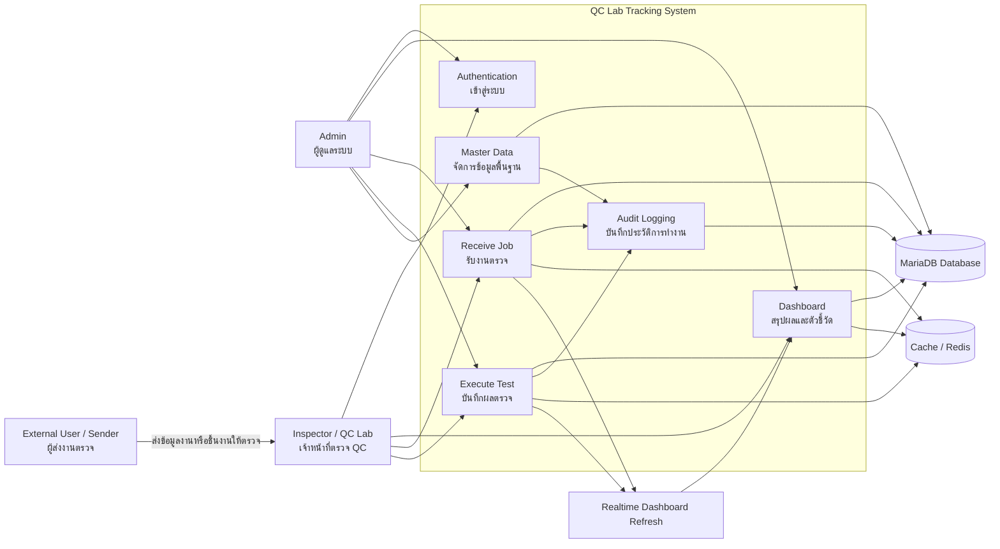

### คำอธิบายใต้ภาพสำหรับใส่ในเล่ม

แผนภาพบริบทของระบบแสดงให้เห็นว่า QC Lab Tracking System เป็นศูนย์กลางในการรับงาน ตรวจงาน จัดการข้อมูลพื้นฐาน และแสดงผล Dashboard โดยมี Admin และ Inspector เป็นผู้ใช้งานหลัก ระบบเชื่อมต่อกับฐานข้อมูล MariaDB สำหรับจัดเก็บข้อมูลถาวร และใช้ Cache / Redis เพื่อเพิ่มประสิทธิภาพในการแสดงข้อมูล

---

## 2. Use Case Diagram / แผนภาพกรณีการใช้งาน

### จุดประสงค์ของไดอะแกรม

Use Case Diagram ใช้อธิบายว่าผู้ใช้แต่ละประเภทสามารถทำอะไรได้บ้างในระบบ โดยเน้นขอบเขตการใช้งานของ Admin และ Inspector ไดอะแกรมนี้ช่วยให้เห็นฟีเจอร์หลักและสิทธิ์การเข้าถึงของแต่ละบทบาท

### องค์ประกอบในภาพ

- `Admin` มีสิทธิ์ใช้งานทุกส่วนของระบบ รวมถึงจัดการ Master Data และผู้ใช้
- `Inspector` ใช้งานส่วนปฏิบัติงานหลัก ได้แก่ Dashboard, Receive Job และ Execute Test
- Use case กลุ่ม workflow ได้แก่ รับงาน แก้ไขงาน ปิดงาน เปิดงานอีกครั้ง และบันทึกผลตรวจ
- Use case กลุ่ม Master Data ได้แก่ จัดการแผนก อุปกรณ์ วิธีตรวจ ผู้ใช้ภายใน และผู้ส่งงาน
- `System records Audit Log` เป็นกระบวนการที่ระบบทำอัตโนมัติเมื่อเกิดการเพิ่ม แก้ไข ลบ หรือ restore ข้อมูลสำคัญ

### ความสัมพันธ์และเส้นเชื่อม

- Admin เชื่อมกับ use case ทุกตัว เพราะมีสิทธิ์ควบคุมระบบทั้งหมด
- Inspector เชื่อมกับ use case ที่เกี่ยวกับการทำงานประจำวันของห้อง QC
- เส้นประไปยัง Audit Log หมายถึงระบบบันทึกประวัติให้อัตโนมัติ ไม่ใช่ action ที่ผู้ใช้กดโดยตรง

### Mermaid Diagram

```mermaid
flowchart TB
  Admin(("Admin"))
  Inspector(("Inspector"))

  Login["Login / Logout"]
  ViewDashboard["View Dashboard"]
  CreateJob["Create Receive Job"]
  ManageJob["Edit / Delete / Restore Job"]
  CloseJob["Close / Reopen Job"]
  RecordResult["Record Test Result"]
  ManageResult["Edit / Delete / Restore Test Result"]
  ManageDept["Manage Departments"]
  ManageEquip["Manage Equipments"]
  ManageMethod["Manage Test Methods"]
  ManageInternal["Manage Internal Users"]
  ManageExternal["Manage External Users"]
  AuditTrack["System records Audit Log"]

  Admin --> Login
  Admin --> ViewDashboard
  Admin --> CreateJob
  Admin --> ManageJob
  Admin --> CloseJob
  Admin --> RecordResult
  Admin --> ManageResult
  Admin --> ManageDept
  Admin --> ManageEquip
  Admin --> ManageMethod
  Admin --> ManageInternal
  Admin --> ManageExternal

  Inspector --> Login
  Inspector --> ViewDashboard
  Inspector --> CreateJob
  Inspector --> ManageJob
  Inspector --> CloseJob
  Inspector --> RecordResult
  Inspector --> ManageResult

  CreateJob -.-> AuditTrack
  ManageJob -.-> AuditTrack
  CloseJob -.-> AuditTrack
  RecordResult -.-> AuditTrack
  ManageResult -.-> AuditTrack
  ManageDept -.-> AuditTrack
  ManageEquip -.-> AuditTrack
  ManageMethod -.-> AuditTrack
  ManageInternal -.-> AuditTrack
  ManageExternal -.-> AuditTrack
```

### คำอธิบายใต้ภาพสำหรับใส่ในเล่ม

แผนภาพกรณีการใช้งานแสดงความสามารถของผู้ใช้แต่ละบทบาทในระบบ โดย Admin สามารถจัดการระบบได้ครบทุกส่วน ส่วน Inspector สามารถใช้งานฟังก์ชันหลักที่เกี่ยวข้องกับการรับงานและบันทึกผลตรวจ ระบบจะบันทึก Audit Log อัตโนมัติเมื่อมีการเปลี่ยนแปลงข้อมูลสำคัญ

---

## 3. Activity Diagram / แผนภาพกิจกรรม

### จุดประสงค์ของไดอะแกรม

Activity Diagram ใช้อธิบายลำดับขั้นตอนการทำงานหลักของระบบ ตั้งแต่การเข้าสู่ระบบ การรับงาน การบันทึกผลตรวจ จนถึงการปิดงาน เหมาะสำหรับแสดง workflow จริงของห้อง QC

### องค์ประกอบในภาพ

- ขั้นตอน Login ตรวจสอบว่าผู้ใช้มีสิทธิ์เข้าใช้งานระบบหรือไม่
- ขั้นตอน Receive Job ใช้สร้างงานตรวจใหม่ลงใน `Transaction_Header`
- ขั้นตอน Execute Test ใช้บันทึกผลตรวจลงใน `Transaction_Detail`
- จุดตัดสินใจ validate ใช้ตรวจสอบความถูกต้องของข้อมูลก่อนบันทึก
- ขั้นตอน Audit Log และ Cache Refresh เป็นกระบวนการหลังจากบันทึกข้อมูลสำเร็จ
- ขั้นตอน Close Job ใช้กำหนด `return_date` เพื่อระบุว่างานจบแล้ว

### ความสัมพันธ์และเส้นเชื่อม

- ถ้า Login ไม่สำเร็จ ระบบจะวนกลับไปให้เข้าสู่ระบบใหม่
- ถ้าข้อมูลรับงานไม่ถูกต้อง ระบบจะให้แก้ไขข้อมูลรับงาน
- ถ้าข้อมูลผลตรวจไม่ถูกต้อง ระบบจะให้แก้ไขข้อมูลผลตรวจ
- หลังบันทึกผลตรวจ ผู้ใช้สามารถบันทึกผลเพิ่มได้หากงานนั้นยังมีรายการตรวจเพิ่มเติม
- เมื่อไม่มีผลตรวจเพิ่มเติม ผู้ใช้สามารถปิดงานได้

### Mermaid Diagram

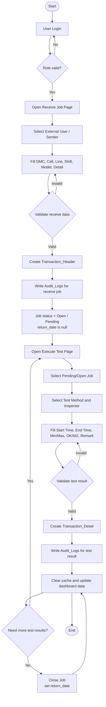

### คำอธิบายใต้ภาพสำหรับใส่ในเล่ม

แผนภาพกิจกรรมแสดงขั้นตอนหลักของระบบ ตั้งแต่ผู้ใช้เข้าสู่ระบบ รับงานตรวจ บันทึกข้อมูลงาน เลือกงานที่ยังเปิดอยู่ บันทึกผลการตรวจ และปิดงานเมื่อดำเนินการเสร็จ ระบบมีการตรวจสอบข้อมูลก่อนบันทึก และมีการอัปเดต cache กับ Dashboard หลังข้อมูลเปลี่ยนแปลง

---

## 4. Entity Relationship Diagram / แผนภาพความสัมพันธ์ของฐานข้อมูล

### จุดประสงค์ของไดอะแกรม

ER Diagram ใช้อธิบายโครงสร้างฐานข้อมูลของระบบว่ามี entity หรือตารางใดบ้าง แต่ละตารางเก็บข้อมูลอะไร และมีความสัมพันธ์กันอย่างไร ไดอะแกรมนี้เป็นส่วนสำคัญของเล่มจบ เพราะแสดงโครงสร้างข้อมูลที่ระบบใช้จริง

### องค์ประกอบในภาพ

- `Departments` เก็บข้อมูลแผนก
- `External_Users` เก็บข้อมูลผู้ส่งงาน และเชื่อมกับแผนก
- `Internal_Users` เก็บข้อมูลผู้ใช้ภายใน เช่น Admin และ Inspector
- `Equipments` เก็บข้อมูลอุปกรณ์ที่ใช้ในการตรวจ
- `Test_Methods` เก็บวิธีการตรวจ และเชื่อมกับอุปกรณ์
- `Transaction_Header` เก็บข้อมูลงานรับเข้า เช่น DMC, Cell, Line, Shift, Model, วันรับงาน และวันปิดงาน
- `Transaction_Detail` เก็บผลตรวจ เช่น วิธีตรวจ ผู้ตรวจ เวลาเริ่ม เวลาเสร็จ ค่า Min/Max ผล OK/NG และหมายเหตุ
- `Audit_Logs` เก็บประวัติการกระทำของผู้ใช้ เช่น create, update, delete และ restore

### ความสัมพันธ์และเส้นเชื่อม

- 1 Department มี External User ได้หลายคน
- 1 External User สามารถส่งงานได้หลายงาน
- 1 Internal User สามารถรับงานและตรวจงานได้หลายรายการ
- 1 Transaction Header มี Transaction Detail ได้หลายรายการ
- 1 Equipment มี Test Method ได้หลายวิธี
- 1 Test Method ถูกใช้ใน Transaction Detail ได้หลายรายการ
- 1 Internal User สามารถสร้าง Audit Log ได้หลายรายการ

### Mermaid Diagram

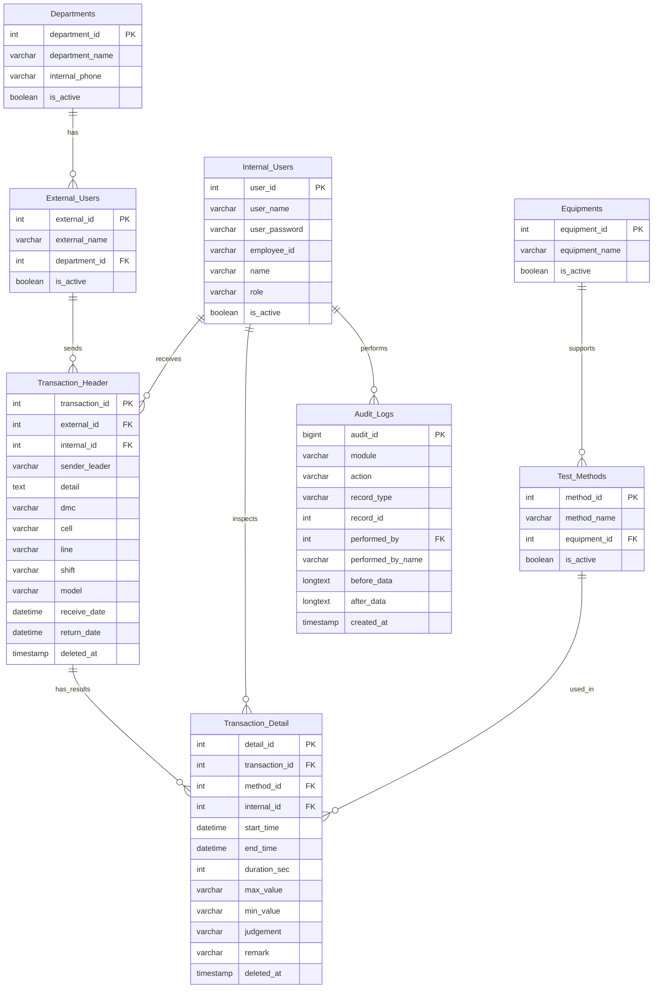

### คำอธิบายใต้ภาพสำหรับใส่ในเล่ม

แผนภาพ ER แสดงโครงสร้างฐานข้อมูลของระบบ โดยมี `Transaction_Header` เป็นตารางหลักสำหรับเก็บข้อมูลงานรับเข้า และ `Transaction_Detail` เป็นตารางสำหรับเก็บผลตรวจแต่ละรายการ ข้อมูลทั้งสองส่วนเชื่อมกับผู้ส่งงาน ผู้ตรวจ วิธีตรวจ และอุปกรณ์ นอกจากนี้ระบบยังมี `Audit_Logs` สำหรับบันทึกประวัติการเปลี่ยนแปลงข้อมูล

---

## 5. Data Flow Diagram Level 0 / แผนภาพกระแสข้อมูลระดับ 0

### จุดประสงค์ของไดอะแกรม

DFD Level 0 ใช้อธิบายการไหลของข้อมูลในภาพรวม โดยมองระบบเป็น process หลักเพียง process เดียว และแสดงว่าใครส่งข้อมูลเข้า ใครรับข้อมูลออก และข้อมูลถูกจัดเก็บไว้ที่ใด

### องค์ประกอบในภาพ

- `Admin / Inspector` เป็น external entity ที่ส่งข้อมูลเข้าสู่ระบบและรับผลลัพธ์จากระบบ
- `QC Lab Tracking System` เป็น process หลักที่ประมวลผลข้อมูลทั้งหมด
- `Master Data` เป็น data store ของข้อมูลพื้นฐาน
- `Transaction_Header` เป็น data store ของข้อมูลงานรับเข้า
- `Transaction_Detail` เป็น data store ของผลตรวจ
- `Audit_Logs` เป็น data store ของประวัติการกระทำ
- `Cache` เป็น data store ชั่วคราวสำหรับข้อมูลที่ถูกเรียกใช้บ่อย

### ความสัมพันธ์และเส้นเชื่อม

- ผู้ใช้ส่งข้อมูล login, รับงาน, ผลตรวจ และข้อมูลพื้นฐานเข้าสู่ระบบ
- ระบบส่งข้อมูล Dashboard, รายการงาน และผลการทำงานกลับไปยังผู้ใช้
- ระบบอ่านและเขียนข้อมูลลง data store ตามประเภทข้อมูล
- ระบบใช้ cache เพื่อเพิ่มความเร็วในการแสดงข้อมูล

### Mermaid Diagram

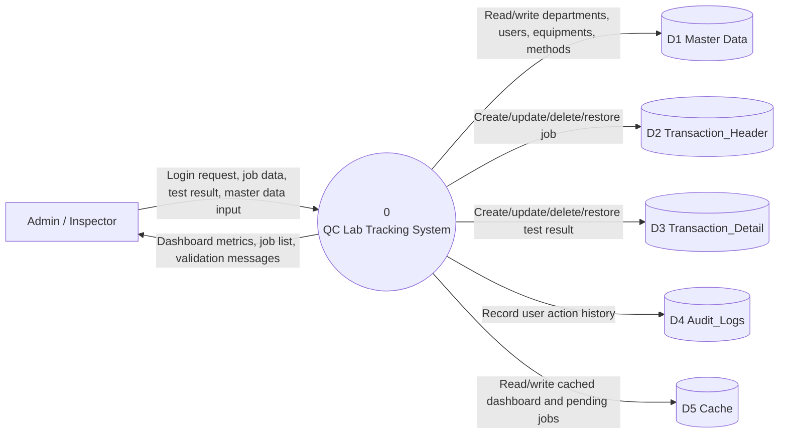

### คำอธิบายใต้ภาพสำหรับใส่ในเล่ม

แผนภาพกระแสข้อมูลระดับ 0 แสดงภาพรวมการไหลของข้อมูลระหว่างผู้ใช้ ระบบ และแหล่งเก็บข้อมูล โดยระบบรับข้อมูลจาก Admin และ Inspector จากนั้นประมวลผลและจัดเก็บลงฐานข้อมูลตามประเภทของข้อมูล เช่น ข้อมูลงานรับเข้า ผลตรวจ ข้อมูลพื้นฐาน และประวัติการทำงาน

---

## 6. Data Flow Diagram Level 1 / แผนภาพกระแสข้อมูลระดับ 1

### จุดประสงค์ของไดอะแกรม

DFD Level 1 ใช้ขยายรายละเอียดจาก DFD Level 0 โดยแยก process ภายในระบบออกเป็นงานย่อย เช่น Authentication, Receive Job, Execute Test, Dashboard และ Master Data ทำให้เห็นว่าข้อมูลไหลผ่านแต่ละ module อย่างไร

### องค์ประกอบในภาพ

- `1.0 Authentication` ตรวจสอบข้อมูลผู้ใช้จาก `Internal_Users`
- `2.0 Receive Job` รับข้อมูลงานและบันทึกลง `Transaction_Header`
- `3.0 Execute Test` เลือกงานที่เปิดอยู่และบันทึกผลลง `Transaction_Detail`
- `4.0 Dashboard` อ่านข้อมูลงานและผลตรวจเพื่อคำนวณตัวชี้วัด
- `5.0 Master Data Management` จัดการข้อมูลพื้นฐานของระบบ
- `6.0 Audit Logging` บันทึกประวัติการกระทำของผู้ใช้

### ความสัมพันธ์และเส้นเชื่อม

- Authentication อ่านข้อมูลผู้ใช้เพื่อตรวจสอบสิทธิ์
- Receive Job อ่านข้อมูลผู้ส่งงานและผู้รับงาน แล้วสร้างรายการใน `Transaction_Header`
- Execute Test อ่านงานที่ยังเปิดอยู่จาก `Transaction_Header` และบันทึกผลใน `Transaction_Detail`
- Dashboard อ่านข้อมูลจาก `Transaction_Header` และ `Transaction_Detail` เพื่อสรุปตัวเลข
- Master Data อ่านและเขียนข้อมูลพื้นฐาน
- ทุก process ที่เปลี่ยนข้อมูลสำคัญส่งข้อมูลไปยัง Audit Logging

### Mermaid Diagram

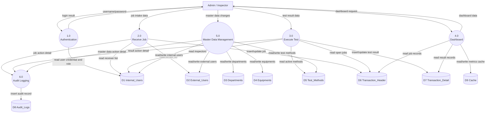

### คำอธิบายใต้ภาพสำหรับใส่ในเล่ม

แผนภาพกระแสข้อมูลระดับ 1 แสดงรายละเอียดภายในระบบว่าแต่ละ module มีการอ่านและเขียนข้อมูลกับ data store ใดบ้าง โดย workflow หลักเริ่มจากการตรวจสอบสิทธิ์ รับงาน บันทึกผลตรวจ และนำข้อมูลไปใช้แสดง Dashboard ขณะเดียวกันระบบจะบันทึก Audit Log เมื่อมีการเปลี่ยนแปลงข้อมูลสำคัญ

---

## 7. System Architecture Diagram / แผนภาพสถาปัตยกรรมระบบ

### จุดประสงค์ของไดอะแกรม

System Architecture Diagram ใช้อธิบายโครงสร้างทางเทคนิคของระบบ ว่าระบบประกอบด้วย layer ใดบ้าง และแต่ละ layer เชื่อมต่อกันอย่างไร ไดอะแกรมนี้เหมาะสำหรับอธิบายเทคโนโลยีที่ใช้พัฒนาระบบ

### องค์ประกอบในภาพ

- `User Browser` คือเครื่องของผู้ใช้งาน
- `Vue 3 Pages` คือหน้า frontend ของระบบ
- `Inertia.js` ทำหน้าที่เชื่อม Vue frontend กับ Laravel backend
- `Tailwind UI` ใช้จัดรูปแบบหน้าจอ
- `Chart.js Dashboard` ใช้แสดงกราฟและข้อมูลสรุปบน Dashboard
- `Laravel Routes` รับ request จาก frontend
- `Auth Middleware` ตรวจสอบการเข้าสู่ระบบและสิทธิ์
- `Controllers` ประมวลผล request ของแต่ละ module
- `DashboardMetricsService` คำนวณข้อมูลสรุปสำหรับ Dashboard
- `Eloquent Models` ติดต่อกับฐานข้อมูล
- `AuditLogger` บันทึกประวัติการทำงาน
- `MariaDB` เก็บข้อมูลถาวรของระบบ
- `Redis / Cache` เก็บข้อมูลชั่วคราวเพื่อเพิ่มความเร็ว

### ความสัมพันธ์และเส้นเชื่อม

- ผู้ใช้เปิดระบบผ่าน Browser แล้วใช้งาน Vue Page
- Vue ส่ง request ผ่าน Inertia ไปยัง Laravel Routes
- Routes ผ่าน Auth Middleware เพื่อคุมสิทธิ์
- Controllers ประมวลผลและเรียก Models, Services และ AuditLogger
- Models และ Services อ่านเขียนข้อมูลจาก MariaDB
- Controllers และ Services ใช้ Redis / Cache ในงานที่ต้องเรียกข้อมูลซ้ำ

### Mermaid Diagram

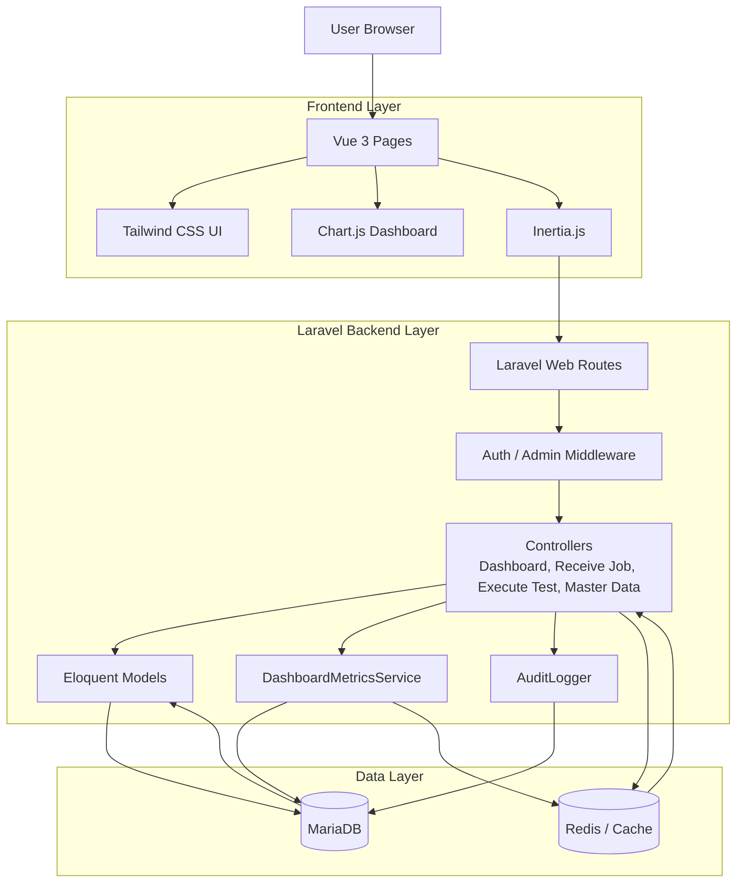

### คำอธิบายใต้ภาพสำหรับใส่ในเล่ม

แผนภาพสถาปัตยกรรมระบบแสดงโครงสร้างของ QC Lab Tracking System โดยแบ่งเป็น Frontend Layer, Backend Layer และ Data Layer ผู้ใช้ทำงานผ่าน Browser และหน้า Vue 3 ส่วน backend ใช้ Laravel ในการตรวจสอบสิทธิ์ ประมวลผลข้อมูล และติดต่อฐานข้อมูล MariaDB พร้อมใช้ Redis / Cache เพื่อเพิ่มประสิทธิภาพในการโหลดข้อมูล

---

## 8. Sequence Diagram: Receive Job / แผนภาพลำดับการทำงานของการรับงาน

### จุดประสงค์ของไดอะแกรม

Sequence Diagram: Receive Job ใช้อธิบายลำดับการสื่อสารระหว่างผู้ใช้ หน้า frontend, route, controller, database, audit logger และ cache ในกรณีที่ผู้ใช้สร้างงานตรวจใหม่

### องค์ประกอบในภาพ

- `Inspector` คือผู้รับงานตรวจ
- `ReceiveJob Vue Page` คือหน้า frontend ที่กรอกข้อมูลงาน
- `Laravel Route` คือ route `POST /receive-job`
- `ReceiveJobController` คือ controller ที่ validate และบันทึกงาน
- `MariaDB` คือฐานข้อมูลที่เก็บ `Transaction_Header`
- `AuditLogger` คือ class สำหรับบันทึกประวัติ
- `Cache/Dashboard` คือ cache และข้อมูล Dashboard ที่ต้องอัปเดตหลังรับงานใหม่

### ลำดับการทำงาน

1. Inspector กรอกข้อมูลงานในหน้า Receive Job
2. Vue ส่ง request ไปยัง `POST /receive-job`
3. Laravel Route ส่งต่อไปยัง `ReceiveJobController`
4. Controller ตรวจสอบข้อมูล เช่น external user, internal user, DMC, shift และข้อมูลอื่น
5. Controller บันทึกข้อมูลลง `Transaction_Header`
6. ระบบบันทึก Audit Log
7. ระบบล้าง cache ที่เกี่ยวข้องกับรายการงานและ Dashboard
8. ระบบ redirect กลับไปยังหน้า Receive Job พร้อมข้อความสำเร็จ

### Mermaid Diagram

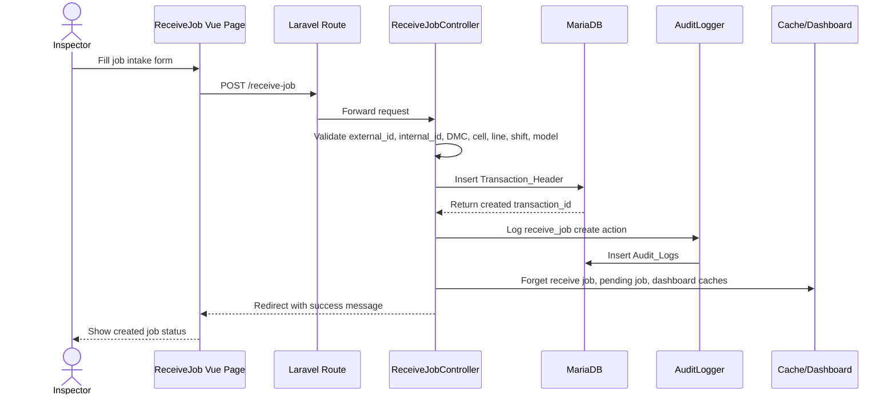

### คำอธิบายใต้ภาพสำหรับใส่ในเล่ม

แผนภาพลำดับการทำงานของการรับงานแสดงขั้นตอนตั้งแต่ Inspector กรอกข้อมูลงานตรวจ ระบบตรวจสอบความถูกต้อง บันทึกลง `Transaction_Header` และสร้าง Audit Log จากนั้นระบบจะล้าง cache ที่เกี่ยวข้องเพื่อให้รายการงานและ Dashboard แสดงข้อมูลล่าสุด

---

## 9. Sequence Diagram: Execute Test / แผนภาพลำดับการทำงานของการบันทึกผลตรวจ

### จุดประสงค์ของไดอะแกรม

Sequence Diagram: Execute Test ใช้อธิบาย flow สำคัญของระบบ คือการบันทึกผลตรวจ OK/NG ลงใน `Transaction_Detail` โดยแสดงการสื่อสารระหว่าง frontend, backend, database, audit logger และ cache

### องค์ประกอบในภาพ

- `Inspector` คือผู้ตรวจหรือผู้บันทึกผลตรวจ
- `ExecuteTest Vue Page` คือหน้าบันทึกผลตรวจ
- `Laravel Route` คือ route `POST /execute-test`
- `ExecuteTestController` คือ controller ที่ตรวจสอบข้อมูลและบันทึกผล
- `MariaDB` คือฐานข้อมูลที่เก็บ `Transaction_Header`, `Transaction_Detail` และ `Audit_Logs`
- `AuditLogger` คือ class สำหรับบันทึกประวัติการเพิ่มผลตรวจ
- `Cache/Dashboard` คือ cache และข้อมูล Dashboard ที่ต้อง refresh หลังผลตรวจเปลี่ยน

### ลำดับการทำงาน

1. Inspector เลือกงานที่ยังเปิดอยู่
2. Inspector เลือกวิธีตรวจ ผู้ตรวจ เวลา และผล OK/NG
3. Vue ส่ง request ไปยัง `POST /execute-test`
4. Controller validate ข้อมูลและตรวจว่า job ยังไม่ถูกปิด
5. Controller คำนวณ `duration_sec` จาก start time และ end time
6. Controller บันทึกผลลง `Transaction_Detail`
7. AuditLogger บันทึก action ลง `Audit_Logs`
8. Controller ล้าง cache และอัปเดตข้อมูล Dashboard
9. ระบบส่งข้อความสำเร็จกลับไปยังหน้า Execute Test

### Mermaid Diagram

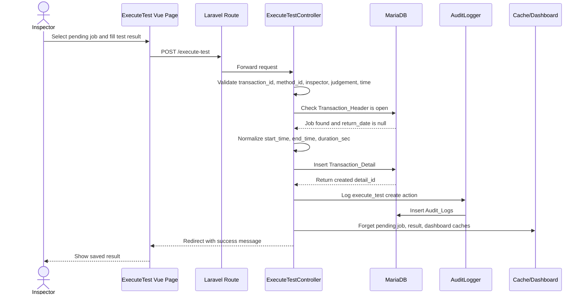

### คำอธิบายใต้ภาพสำหรับใส่ในเล่ม

แผนภาพลำดับการทำงานของการบันทึกผลตรวจแสดงขั้นตอนตั้งแต่ Inspector เลือกงานที่ยังเปิดอยู่ กรอกผลตรวจ OK/NG ระบบตรวจสอบข้อมูล บันทึกผลลง `Transaction_Detail` และบันทึก Audit Log จากนั้นระบบล้าง cache เพื่อให้ Dashboard แสดงข้อมูลล่าสุด

---

## 10. State Diagram: Job Status / แผนภาพสถานะของงานตรวจ

### จุดประสงค์ของไดอะแกรม

State Diagram ใช้อธิบายสถานะของงานตรวจตั้งแต่เริ่มสร้างงานจนถึงปิดงาน รวมถึงกรณีแก้ไข ลบ และ restore ข้อมูล ไดอะแกรมนี้ช่วยให้เห็น lifecycle ของ `Transaction_Header`

### องค์ประกอบในภาพ

- `New` คือสถานะก่อนบันทึกงาน
- `Open / Pending` คือสถานะหลังสร้าง `Transaction_Header` และ `return_date` ยังเป็น `null`
- `Has Test Result` คือสถานะที่งานมีผลตรวจใน `Transaction_Detail` อย่างน้อยหนึ่งรายการ
- `Closed` คือสถานะที่งานถูกปิดแล้ว โดยกำหนด `return_date`
- `Deleted` คือสถานะที่งานถูกลบแบบ soft delete เมื่อมี column `deleted_at`
- `Restored` คือสถานะหลังนำงานที่ถูกลบกลับมาใช้งาน

### ความสัมพันธ์และเส้นเชื่อม

- เมื่อสร้างงานใหม่สำเร็จ งานเข้าสู่สถานะ Open / Pending
- เมื่องานมีผลตรวจ งานยังเปิดอยู่แต่มีข้อมูลผลตรวจแล้ว
- เมื่องานเสร็จสิ้น ผู้ใช้ปิดงานและระบบกำหนด `return_date`
- งานที่ปิดแล้วสามารถ reopen ได้โดยตั้ง `return_date` กลับเป็น `null`
- งานสามารถถูก soft delete และ restore ได้ตามสิทธิ์ของผู้ใช้

### Mermaid Diagram

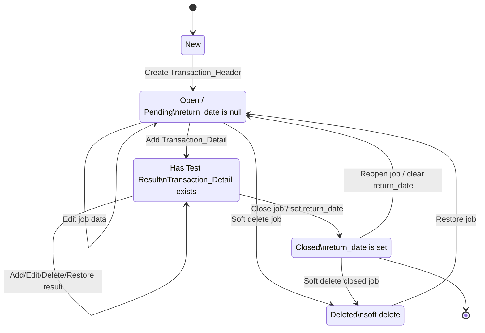

### คำอธิบายใต้ภาพสำหรับใส่ในเล่ม

แผนภาพสถานะของงานตรวจแสดง lifecycle ของ `Transaction_Header` โดยงานเริ่มจากการสร้างใหม่เป็นสถานะ Open / Pending จากนั้นสามารถเพิ่มผลตรวจได้ เมื่อดำเนินการเสร็จจึงปิดงานด้วยการกำหนด `return_date` ระบบยังรองรับการลบแบบ soft delete และการ restore เพื่อเรียกคืนข้อมูล

---

## 11. Class / Model Relationship Diagram / แผนภาพความสัมพันธ์ของ Laravel Models

### จุดประสงค์ของไดอะแกรม

Class / Model Relationship Diagram ใช้อธิบายความสัมพันธ์ของ Eloquent Models ใน Laravel แบบย่อ เพื่อให้เห็นว่าฝั่ง code เชื่อมกับฐานข้อมูลอย่างไร ไดอะแกรมนี้ช่วยอธิบายระบบในมุมมองของ developer

### องค์ประกอบในภาพ

- `TransactionHeader` map กับตาราง `Transaction_Header`
- `TransactionDetail` map กับตาราง `Transaction_Detail`
- `User` map กับตาราง `Internal_Users`
- `ExternalUser` map กับตาราง `External_Users`
- `Department` map กับตาราง `Departments`
- `Equipment` map กับตาราง `Equipments`
- `TestMethod` map กับตาราง `Test_Methods`
- `AuditLog` map กับตาราง `Audit_Logs`

### ความสัมพันธ์และเส้นเชื่อม

- `Department` has many `ExternalUser`
- `ExternalUser` belongs to `Department`
- `ExternalUser` has many `TransactionHeader`
- `User` has many `TransactionHeader` ในฐานะผู้รับงาน
- `TransactionHeader` has many `TransactionDetail`
- `TransactionDetail` belongs to `TransactionHeader`
- `TestMethod` belongs to `Equipment`
- `TransactionDetail` belongs to `TestMethod`
- `AuditLog` belongs to `User` ในฐานะ actor ของการกระทำ

### Mermaid Diagram

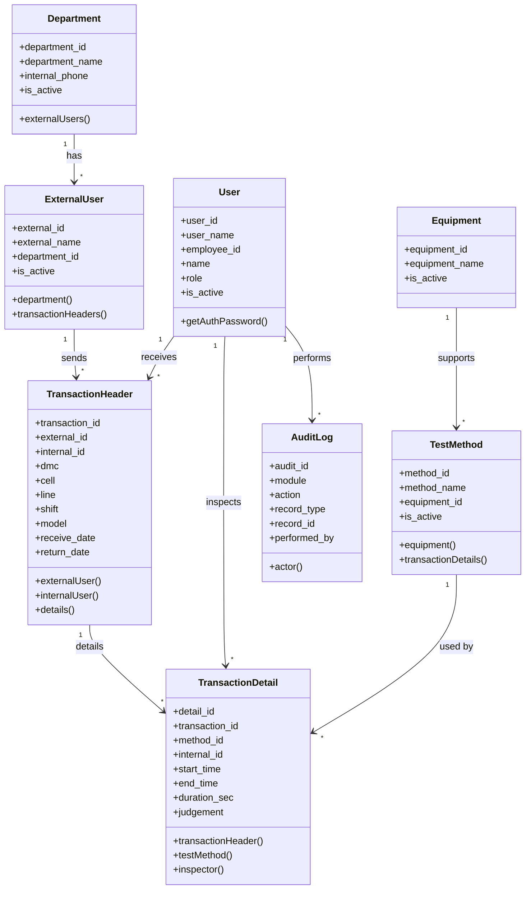

### คำอธิบายใต้ภาพสำหรับใส่ในเล่ม

แผนภาพความสัมพันธ์ของ Laravel Models แสดงโครงสร้าง model หลักของระบบและความสัมพันธ์ที่ใช้ใน code โดย `TransactionHeader` เป็น model หลักของงานรับเข้า และ `TransactionDetail` เป็น model ของผลตรวจ ส่วน model อื่นใช้เป็นข้อมูลอ้างอิง เช่น ผู้ใช้ ผู้ส่งงาน วิธีตรวจ อุปกรณ์ และ Audit Log

---

## สรุปการใช้งาน Diagram ในเล่มจบ

ลำดับการนำเสนอที่แนะนำคือเริ่มจากภาพรวมไปสู่รายละเอียด ได้แก่ System Context Diagram, Use Case Diagram, Activity Diagram, ER Diagram, DFD Level 0, DFD Level 1, System Architecture Diagram, Sequence Diagram, State Diagram และ Class / Model Relationship Diagram

ไดอะแกรมทั้งหมดในเอกสารนี้เน้นขอบเขตของระบบ QC Lab Tracking System ตาม workflow หลัก คือการเข้าสู่ระบบ การรับงานตรวจ การบันทึกผลตรวจ การแสดง Dashboard การจัดการ Master Data และการบันทึก Audit Log
